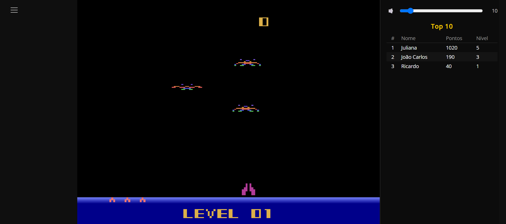

<H1 align = "center">Demon Attack </H1>

  

This repository contains a fork to the Typescript version of Demon Attack, a classic game created in the 80s by Imagic to the Atari 2600 videogame.

The version of Demon Attack used in this repository was originally developed by MeatFighter. The official website of this remake can be found here:

https://meatfighter.com/demon-attack/

## Project Goals

This project was born with an educational goal, meant to teach REST software development concepts to students  in introductory courses of computer programming with Python and Django.

Our goal therefore was to refactor the source code to be used with Django framework and provide a new web interface with a side panel with a highscore list, where the best players and their records can be seen, while also introducing new features and eventual bug fixes / general improvements to the game. 

## What's New

- Added a highscore web server (coded with Python and Django) that registers new records.
- Current level information is now shown in the game screen during gameplay.
- Higher level / score is emphasized in the game over screen (when obtained by the player) 
- Bug fix: gain life music plays alone now (other SFXs are silenced, as it was in the original game).

## How to play

  

Released in 1982, **Demon Attack** is one of the most memorable fixed-screen shooters of the Atari 2600 era. Developed and published by **Imagic**, the game places the player in control of a laser cannon defending a distant planet from relentless waves of winged demons.

Your goal is therefore to survive wave after wave of alien creatures while destroying them with the cannon's laser fire. The demons appear in formations and use different movement and attack patterns, becoming faster and more dangerous as the game progresses, forcing the player to constantly adjust to their behaviour. 

Originally released for the **Atari 2600 in March 1982**, Demon Attack became a major commercial success. By the end of that year, its Atari 2600 version was reportedly the **third best-selling console game of 1982**, behind *Pitfall!* and *Pac-Man*. 

### Controls

<table border=1 width="35%">
<thead>
<tr>
<th align="left" width="10%">Key</th>
<th align="left" width="25%">Action</th>
</tr>
</thead>
<tbody>
<tr><th>Cursor left</th><th>move ship to the left</th></tr>
<tr><th>Cursor right</th><th>move ship to the right</th></tr>
<tr><th>Any other key</th><th>Fire</th></tr>
</tbody>
</table>

### Game tips

Here are some tips that will make you enjoy the game more and also obtain a higher score:

*  **Keep Moving!**: Don't stay in one position for too long. The demons' attack patterns can quickly turn a safe spot into a dangerous one. Move your cannon constantly, especially when enemies begin firing.

* **Watch the Attack Patterns**: Each wave has its own rhythm and movement pattern. Learn how the demons approach and attack, and try to anticipate where they will move rather than simply reacting to them.

* **Deal with the Most Dangerous Enemies First**: When multiple demons are on the screen, concentrate on the enemies that pose the greatest immediate threat. Eliminating a dangerous attacker can give you more room to deal with the others.

## Credits

* Demon Attack (original version) Game programming: Rob Fulop, 
* Demon Attack (original version) Graphics: Michael Becker.
* Demon Attack typescript version: MeatFighter.

## Thanks

* MeatFighter, for creating this and other games and making it available at his webpage. 
* Imagic and the original developers, for creating this great game!

## Legal Notice

This repository is provided **"as is"**. 

All rights to the original game, its characters, graphics, music, and trademarks remain the property of Imagic and their respective owners. 

This project is distributed free of charge for educational purposes and is not intended for commercial use. 

